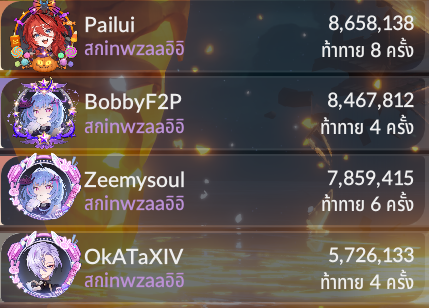
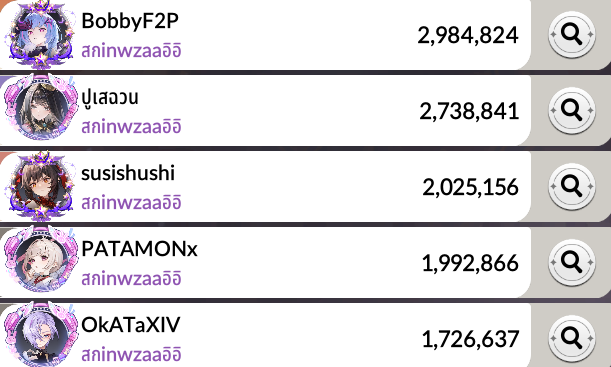
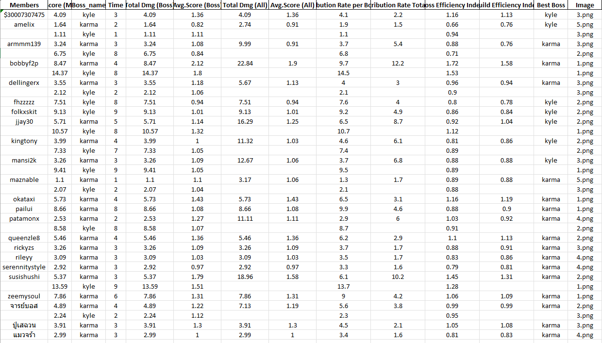
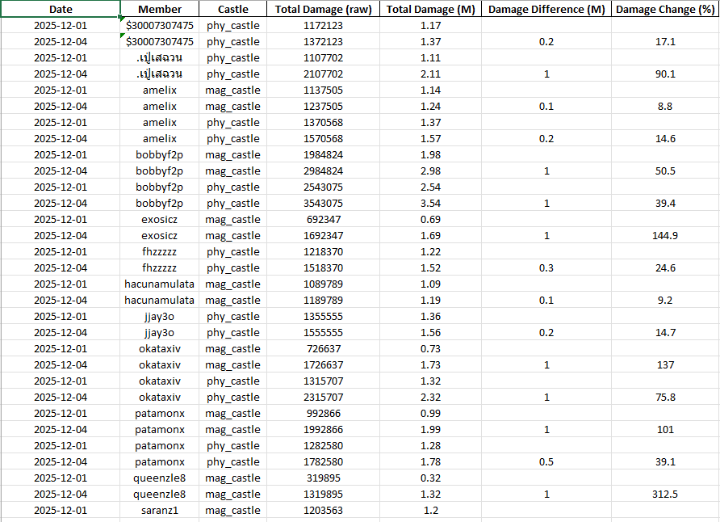
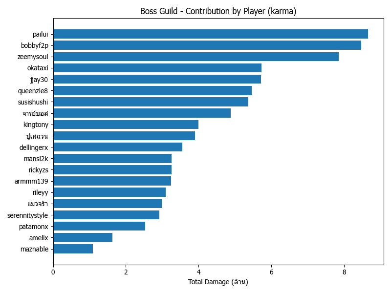
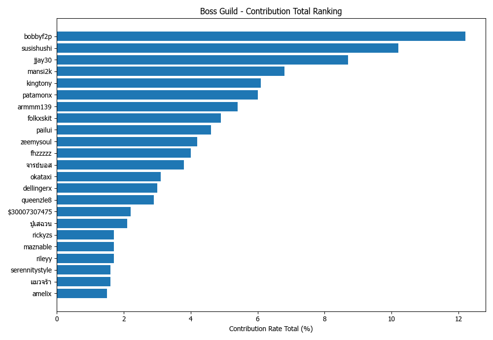
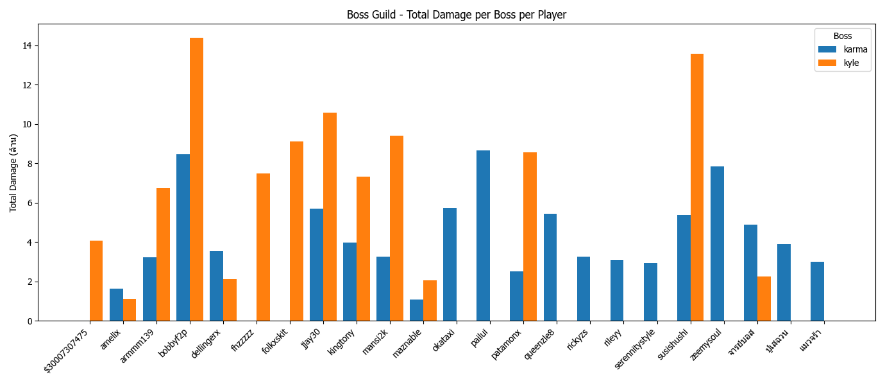

# 🔥 7K Guild OCR Manager

Automated OCR tool for **Boss Guild** and **Castle** reports in Seven Knights.  
It reads screenshots, extracts scores, builds Excel reports, generates graph analysis, and tracks **damage growth** over time for each member.

## 🖼 Example Results

### 📸 Input Screenshot (Boss Guild) & (Castle)



### 📊 Excel Report Output



### 📈 Growth Graph Output




## 👤 Credits

Developed by: **[SusiShushii]**  
GitHub: **https://github.com/SusiShushii**
Description:
  - Fan-made OCR automation tool for **Seven Knights**
  - Extracts **Boss Guild** and **Castle** scores from screenshots
  - Automatically generates **Excel reports** and **Graphs**
  - Tracks **damage growth** for each guild member over time
  - Designed for fast, accurate, and community use

## ⚠️ Disclaimer

This project is a **fan-made, non-commercial tool** created solely for community use only.  
Seven Knights and all related game assets, names, and trademarks are the property of their respective owners. 
This project is **not affiliated with Netmarble**.

## ✅ System Requirements

- **Operating System:** Windows 10 / 11 (64-bit)
- **Python:** 3.12.x (64-bit)
- **Hardware:**
  - CPU: Any modern x64 CPU
  - RAM: 8 GB+ recommended (OCR & Torch can be heavy)
  - **GPU (Optional):** NVIDIA GPU for faster OCR (EasyOCR / Torch)  
    If no GPU is available, the tool automatically falls back to CPU.

---

## 📦 Main Features

- OCR for **Boss Guild** and **Castle** score screens
- Automatic cleaning & merging of OCR’d player names
- Per-boss and per-castle **Excel reports**
- **Growth reports** (damage difference & % change between snapshots)
- Configurable **guild name & keywords** via `config.json`
- Simple batch runners:
  - `Install_Python.bat` – Install Python 3.12
  - `Install_Packages.bat` – Create (Optional)`.venv` and install required packages
  - `run.bat` – Run the main menu

---
```text
🧰 Step 1 – Clone the Repository


git clone https://github.com/yourname/yourrepo.git
cd yourrepo   # e.g. cd OCR

🐍 Step 2 – Install Python (Only If You Don't Have Python)

- Check your installed Python version:
- `python --version`


- You must see Python 3.12.10.
- If not, install using:
    - `Install_Python.bat`

📦 Step 3 – Install Required Packages

Run:

Install_Packages.bat

Install packages from requirements.txt

If successful, you will see:

[SUCCESS] All packages installed successfully.

🛠 4. Install VC++ Redistributable (Optional)
Only required on some systems:

https://aka.ms/vs/17/release/vc_redist.x64.exe

⚙️ Step 5 – Configure Your Guild (config.json)

Main configuration file used by the OCR system (Example Configuration for English Language in `example_en_config.json`):

{
  "GUILD_NAME": "สกinwzaaอิอิ",

  "NON_NAME_KEYWORDS": [
    "ท้าทาย",
    "ครั้ง",
    "ครัง",
    "ครั่ง"
  ],

  "GUILD_EXTRA_KEYWORDS": [
    "inw",
    "อิอิ"
  ],

  "TIME_WORDS": [
    "ครั้ง"
  ]
}

🔹 Field Descriptions
**Key	Description:**
  - GUILD_NAME	Your guild name as shown in-game
  - NON_NAME_KEYWORDS	Words that are not player names
  - GUILD_EXTRA_KEYWORDS	Extra noisy text attached to player names
  - TIME_WORDS	Words related to boss attempt counting

🗂 Step 6 – Folder Structure (IMPORTANT)

Your project MUST follow this structure:

OCR/
├─ app/
│  ├─ __init__.py
│  ├─ boss_guild.py        # OCR Boss Guild
│  ├─ castle.py            # OCR Castle
│  ├─ boss_growth.py       # Boss Guild Growth Report
│  ├─ castle_growth.py     # Castle Growth Report
│  ├─ compute.py
│  ├─ extract.py           # OCR Text Extraction
│  └─ pre_image.py         # Image Preprocessing
│
├─ folders/
│  ├─ boss_guild/          # Boss screenshots
│  │  ├─ kyle/
│  │  ├─ karma/
│  │  └─ ... (one folder per boss, name can be changed)
│  │      └─ 1.png, 2.png, ...
│  │
│  └─ castles/             # Castle screenshots
│     ├─ phy_castle/
│     ├─ mag_castle/
│     └─ ... (one folder per boss, name can be changed)
│         └─ 1.png, 2.png, ...
│
├─ output/
│  ├─ boss_guild/
│  │  ├─ excel/
│  │  ├─ json/
│  │  └─ growth/
│  ├─ castle/
│  │  ├─ excel/
│  │  ├─ json/
│  │  └─ growth/
│  ├─ boss_guild_graphs/
│  └─ castle_graphs/
│
├─ config.json
├─ example_en_config.json
├─ build_exe.bat           # For building .exe file
├─ main.py
├─ requirements.txt
├─ run.bat
├─ Install_Python.bat
└─ Install_Packages.bat

✅ Output/ will be auto-created if missing
-> Put your screenshots into:

- folders/boss_guild/<boss_name>/
- folders/castles/<castle_name>/
- folders/castles/<castle_name>/

📊 Output Files
Report	Location
Boss OCR Excel	output/boss_guild/excel/
Castle OCR Excel	output/castle/excel/
Boss Growth Report	output/boss_guild/growth/
Castle Growth Report	output/castle/growth/
Graph Images	output/*_graphs/

▶️ Step 7 – Run the Program
run.bat

You will see:

============================================
        Guild OCR Tool – Main Menu
============================================
1) Boss Guild OCR  
   (Generates Excel reports from folders/boss_guild/<boss_name>/  
   → output/boss_guild/excel and boss_guild_graphs)
2) Castle OCR  
   (Generates Excel reports from folders/castles/<castle_name>/  
   → output/castle/excel and castle_graphs)
3) Boss Guild Growth Report  
   (Generates Excel growth reports from existing JSON data in  
   output/boss_guild/json → output/boss_guild/growth.  
   The system automatically compares data by date, determines which record is earlier and later,  
   and calculates the damage growth rate or decrease for each member.)
4) Castle Growth Report  
   (Generates Excel growth reports from existing JSON data in  
   output/castle/json → output/castle/growth.  
   The system automatically compares data by date, determines which record is earlier and later,  
   and calculates the growth or decrease rate for each member.)
0) Exit
============================================

